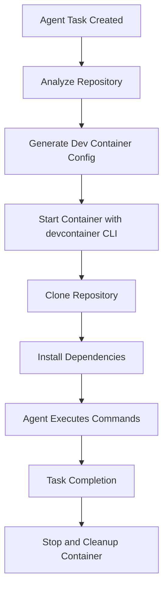

# AI Agents in Dev Containers

This document explains how AI agents run in isolated dev containers using the Dev Containers CLI, providing them with proper execution environments and all necessary development tools.

## 🏗️ Architecture

```
┌─────────────────┐    ┌──────────────────┐    ┌─────────────────┐
│   Agent         │    │ Dev Container    │    │ Repository      │
│   Orchestrator  │◄──►│ Service          │◄──►│ Clone           │
│                 │    │                  │    │                 │
└─────────────────┘    └──────────────────┘    └─────────────────┘
                                │
                                ▼
                       ┌─────────────────┐
                       │ @devcontainers/ │
                       │ cli             │
                       │                 │
                       └─────────────────┘
                                │
                                ▼
                       ┌─────────────────┐
                       │ Docker          │
                       │ Container       │
                       │ - Languages     │
                       │ - Tools         │
                       │ - Dependencies  │
                       └─────────────────┘
```

## 🚀 How It Works

### 1. **Container Creation**
When an AI agent starts a task:
- **Repository Analysis**: Detects languages, frameworks, and tools
- **Config Generation**: Creates appropriate `.devcontainer/devcontainer.json`
- **Container Start**: Uses `@devcontainers/cli` to start the container
- **Repository Clone**: Clones the target repository into the container
- **Dependencies Install**: Installs project dependencies automatically

### 2. **Intelligent Configuration**
The system automatically configures containers based on repository analysis:

#### **Language Detection**
```javascript
// Detects from repository URL and content
- JavaScript/TypeScript → Node.js 18 container
- Python → Python 3.11 container  
- Go → Go 1.21 container
- Rust → Rust latest container
- Java → Java 17 container
```

#### **Framework Detection**
```javascript
// Adds framework-specific tools and extensions
- React → React extensions, port 3000
- Vue → Vue extensions, port 8080
- Django → Django tools, port 8000
- Spring → Maven/Gradle, port 8080
```

#### **Tool Integration**
```javascript
// Includes relevant development tools
- Docker → Docker-in-Docker feature
- Kubernetes → kubectl, helm, minikube
- Testing → Framework-specific test runners
```

### 3. **Agent Execution**
AI agents execute commands directly in the dev container:
- **File Operations**: Read/write files in the container filesystem
- **Command Execution**: Run build, test, and development commands
- **Git Operations**: Perform Git operations with proper credentials
- **Package Management**: Install dependencies using appropriate package managers

## 🔧 Container Configuration

### **Base Images**
```json
{
  "javascript": "mcr.microsoft.com/devcontainers/javascript-node:18",
  "python": "mcr.microsoft.com/devcontainers/python:3.11", 
  "go": "mcr.microsoft.com/devcontainers/go:1.21",
  "rust": "mcr.microsoft.com/devcontainers/rust:latest",
  "java": "mcr.microsoft.com/devcontainers/java:17"
}
```

### **Features**
```json
{
  "ghcr.io/devcontainers/features/common-utils:2": {
    "installZsh": true,
    "configureZshAsDefaultShell": true
  },
  "ghcr.io/devcontainers/features/git:1": {
    "version": "latest"
  },
  "ghcr.io/devcontainers/features/docker-in-docker:2": {
    "enableNonRootDocker": true
  }
}
```

### **Extensions**
```json
[
  "ms-vscode.vscode-json",
  "ms-vscode.vscode-yaml", 
  "eamodio.gitlens",
  "ms-vscode.vscode-typescript-next",
  "ms-python.python",
  "golang.go",
  "rust-lang.rust-analyzer"
]
```

## 🎯 Example Configurations

### **React Application**
```json
{
  "name": "AI Agent Environment - React",
  "image": "mcr.microsoft.com/devcontainers/javascript-node:18",
  "features": {
    "ghcr.io/devcontainers/features/common-utils:2": {},
    "ghcr.io/devcontainers/features/git:1": {}
  },
  "customizations": {
    "vscode": {
      "extensions": [
        "ms-vscode.vscode-typescript-next",
        "ms-vscode.vscode-eslint",
        "esbenp.prettier-vscode",
        "ms-vscode.vscode-react-refactor"
      ]
    }
  },
  "forwardPorts": [3000, 3001],
  "postCreateCommand": "npm install -g typescript ts-node nodemon",
  "workspaceFolder": "/workspace"
}
```

### **Python Django Project**
```json
{
  "name": "AI Agent Environment - Django",
  "image": "mcr.microsoft.com/devcontainers/python:3.11",
  "features": {
    "ghcr.io/devcontainers/features/common-utils:2": {},
    "ghcr.io/devcontainers/features/git:1": {}
  },
  "customizations": {
    "vscode": {
      "extensions": [
        "ms-python.python",
        "ms-python.pylint",
        "ms-python.black-formatter"
      ]
    }
  },
  "forwardPorts": [8000, 8001],
  "postCreateCommand": "pip install --upgrade pip setuptools wheel",
  "workspaceFolder": "/workspace"
}
```

### **Go Microservice**
```json
{
  "name": "AI Agent Environment - Go",
  "image": "mcr.microsoft.com/devcontainers/go:1.21",
  "features": {
    "ghcr.io/devcontainers/features/common-utils:2": {},
    "ghcr.io/devcontainers/features/git:1": {},
    "ghcr.io/devcontainers/features/docker-in-docker:2": {}
  },
  "customizations": {
    "vscode": {
      "extensions": [
        "golang.go",
        "ms-azuretools.vscode-docker"
      ]
    }
  },
  "forwardPorts": [8080, 8090],
  "workspaceFolder": "/workspace"
}
```

## 🎮 Agent Operations

### **File Operations**
```javascript
// Read file in container
const content = await agent.readFile('src/main.js');

// Write file in container  
await agent.writeFile('src/new-feature.js', codeContent);

// Search code in container
const matches = await agent.searchCode('function authenticate');
```

### **Command Execution**
```javascript
// Install dependencies
await agent.executeCommand('npm install');

// Run tests
await agent.executeCommand('npm test');

// Build project
await agent.executeCommand('npm run build');

// Start development server
await agent.executeCommand('npm run dev');
```

### **Git Operations**
```javascript
// Create feature branch
await agent.gitOperation('create_branch', { branchName: 'feature/new-auth' });

// Add and commit changes
await agent.gitOperation('add', { files: ['.'] });
await agent.gitOperation('commit', { message: 'feat: add authentication' });

// Push to remote
await agent.gitOperation('push', { branch: 'feature/new-auth' });
```

## 📊 Container Management

### **API Endpoints**

#### List Active Containers
```bash
GET /dev-containers
```

#### Get Container Status
```bash
GET /dev-containers/{containerId}
```

#### Execute Command
```bash
POST /dev-containers/{containerId}/exec
{
  "command": "npm test",
  "timeout": 60000
}
```

#### Clone Repository
```bash
POST /dev-containers/{containerId}/clone
{
  "repositoryUrl": "https://github.com/user/repo.git",
  "branch": "main"
}
```

#### Install Dependencies
```bash
POST /dev-containers/{containerId}/install
{
  "packageManager": "npm"
}
```

#### Run Tests
```bash
POST /dev-containers/{containerId}/test
{
  "testCommand": "npm test"
}
```

#### Stop Container
```bash
DELETE /dev-containers/{containerId}
```

### **Container Lifecycle**



## 🔧 Setup Requirements

### **Prerequisites**
```bash
# Install Dev Containers CLI globally
npm install -g @devcontainers/cli

# Verify installation
devcontainer --version
```

### **Docker Requirements**
- Docker Engine 20.10+
- Docker Compose V2
- Sufficient disk space for container images
- Network access for pulling base images

### **Environment Variables**
```env
# Dev Container settings
DEVCONTAINER_CLI_PATH=/usr/local/bin/devcontainer
CONTAINER_WORKSPACE_ROOT=/tmp/agent-workspaces
CONTAINER_CLEANUP_INTERVAL=3600000

# Resource limits
MAX_CONCURRENT_CONTAINERS=10
CONTAINER_MEMORY_LIMIT=2g
CONTAINER_CPU_LIMIT=1.0
```

## 🚨 Error Handling & Fallback

### **Container Creation Failures**
If dev container creation fails:
1. **Log Error**: Detailed error logging for debugging
2. **Fallback Mode**: Use traditional MCP client approach
3. **Retry Logic**: Attempt container creation up to 3 times
4. **Resource Check**: Verify Docker daemon and resources

### **Command Execution Failures**
```javascript
try {
  const result = await executeInContainer(containerId, command);
  if (result.exitCode !== 0) {
    // Handle command failure
    logger.warn(`Command failed: ${result.stderr}`);
  }
} catch (error) {
  // Handle container communication failure
  logger.error(`Container execution failed: ${error.message}`);
}
```

### **Container Cleanup**
- **Automatic Cleanup**: Containers are cleaned up when agents terminate
- **Stale Container Detection**: Periodic cleanup of orphaned containers
- **Resource Monitoring**: Monitor disk space and container count
- **Manual Cleanup**: API endpoint for manual container cleanup

## 📈 Performance Considerations

### **Container Startup Time**
- **Base Image Caching**: Pre-pull common base images
- **Layer Optimization**: Use multi-stage builds for faster startup
- **Resource Allocation**: Appropriate CPU/memory limits

### **Resource Usage**
- **Container Limits**: Memory and CPU limits per container
- **Concurrent Limits**: Maximum number of concurrent containers
- **Disk Space**: Monitor workspace disk usage

### **Network Performance**
- **Local Registry**: Use local Docker registry for faster pulls
- **Network Isolation**: Containers in isolated networks
- **Port Management**: Dynamic port allocation for services

## 🔍 Monitoring & Debugging

### **Container Health Checks**
```bash
# Check container status
curl http://localhost:9000/dev-containers/{containerId}

# Execute health check command
curl -X POST http://localhost:9000/dev-containers/{containerId}/exec \
  -d '{"command": "echo alive"}'
```

### **Logs and Debugging**
```bash
# View container logs
docker logs agent-container-{containerId}

# Access container shell for debugging
devcontainer exec --workspace-folder /path/to/workspace -- /bin/bash
```

### **Performance Metrics**
- Container startup time
- Command execution duration
- Resource utilization
- Success/failure rates

## 🚀 Benefits

### **For AI Agents**
- **Proper Execution Environment**: Full development toolchain available
- **Language-Specific Tools**: Appropriate compilers, interpreters, and tools
- **Dependency Management**: Automatic installation and management
- **Isolation**: Each agent works in isolated environment

### **For Development Teams**
- **Consistency**: Same environment as human developers
- **Reproducibility**: Consistent results across different systems
- **Security**: Isolated execution prevents system contamination
- **Scalability**: Multiple agents can work simultaneously

### **For System Administration**
- **Resource Control**: CPU and memory limits per container
- **Easy Cleanup**: Automatic container lifecycle management
- **Monitoring**: Full visibility into agent execution
- **Debugging**: Easy access to container state and logs

This dev container integration ensures that AI agents have access to the same high-quality development environments that human developers use, enabling them to perform complex development tasks with proper tooling and isolation.